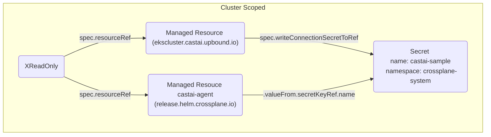
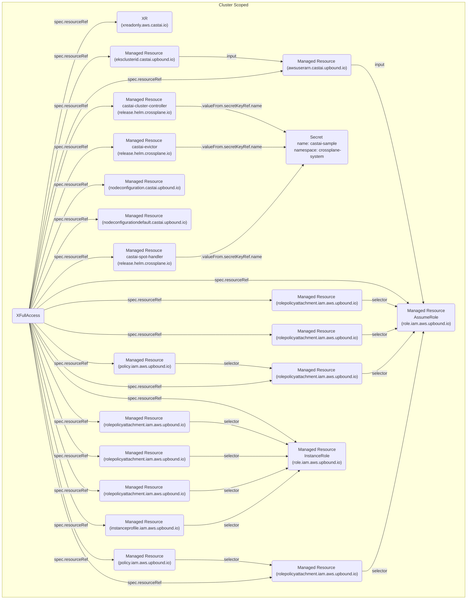

# platform-ref-castai

This repository defines a [Crossplane configuration package](https://docs.crossplane.io/v1.11/concepts/packages/#configuration-packages) that demonstrates provisioning and using CAST AI.

## Composition Overview

The example platform supports the use case of
- ReadOnly Mode
- FullAccess Mode

The Infrastructure team deploys and manages the CAST AI infrastructure using the
following Compositions:






## Deploying the Reference Platform

First you will need access to a Kubernetes cluster. Ensure you are
using the correct context:

```sh
kubectl config current-context
```

To install Crossplane run:

```console
helm repo add crossplane-stable https://charts.crossplane.io/stable
helm repo update
helm install crossplane \
--namespace crossplane-system \
--create-namespace crossplane-stable/crossplane 
```

Install the required Providers:

```console
kubectl apply -f examples/providers.yaml
```

You can keep track of the provider install:

```console
kubectl get -f examples/providers.yaml
```

Next, install the CompositeResourceDefinitions and Compositions:

```console
kubectl apply -f apis/XFullAccess -f apis/XReadOnly
```
The Custom Platform APIs are Kubernetes `CompositeResourceDefinition` objects or `XRD`
for short. We can list them using `kubectl`:

```console
kubectl get xrd
```

The following XRDs should be `ESTABLISHED` and `OFFERED`:

```console
NAME                      ESTABLISHED   OFFERED   AGE
xfullaccess.aws.cast.ai   True                    5m
xreadonly.aws.cast.ai     True                    5m
```

## Authenticating to AWS

Now that Crossplane, the Provider and all the Compositions are installed we
need to give the provider AWS credentials. This is done by creating a `ProviderConfig`.

```sh
kubectl create secret generic aws-creds -n crossplane-system --from-file=creds=./creds.conf
```

### Configure the Provider with AWS Credentials

We will create the following `ProviderConfig` object to use the AWS credentials
from the previous step. See [AUTHENTICATION](https://github.com/upbound/provider-aws/blob/main/AUTHENTICATION.md) for more authentication options like IRSA.

```yaml
apiVersion: aws.upbound.io/v1beta1
kind: ProviderConfig
metadata:
  name: default
spec:
  credentials:
    source: Secret
    secretRef:
      namespace: crossplane-system
      name: aws-creds
      key: creds
```

## Authenticating to CAST AI

Now that Crossplane, the Provider and all the Compositions are installed we
need to give the provider CAST AI credentials. This is done by creating a `ProviderConfig`.

```sh
kubectl create secret generic castai-creds -n crossplane-system --from-file=credentials=./castai.json
```

### Configure the Provider with CAST AI Credentials

We will create the following `ProviderConfig` object to use the CAST AI credentials

```yaml
apiVersion: castai.upbound.io/v1beta1
kind: ProviderConfig
metadata:
  name: default
spec:
  credentials:
    source: Secret
    secretRef:
      namespace: crossplane-system
      name: castai-creds
      key: credentials
```

## Authenticating to Kubernetes Cluster

Now that Crossplane, the Provider and all the Compositions are installed we
need to give the provider helm RBAC access. This is done by creating a `ProviderConfig`.

Make sure provider-helm has enough permissions to install your chart into cluster
We can give admin permissions by running:
```bash
SA=$(kubectl -n crossplane-system get sa -o name | grep provider-helm | sed -e 's|serviceaccount\/|crossplane-system:|g')
kubectl create clusterrolebinding provider-helm-admin-binding --clusterrole cluster-admin --serviceaccount="${SA}"
```

### Configure the Provider Helm with Kubernetes ServiceAccount RBAC

We will create the following `ProviderConfig` object to use the CAST AI credentials

```yaml
apiVersion: helm.crossplane.io/v1beta1
kind: ProviderConfig
metadata:
  name: default
spec:
  credentials:
    source: InjectedIdentity
```

## Deploy all ProviderConfigs

```console
kubectl apply -f examples/providerconfig-creds.yaml
```

We're now ready to deploy the examples.

Using files in the `examples` directory:

```console
kubectl apply -f examples/XReadOnly.yaml
kubectl apply -f examples/XFullAccess.yaml
```

Applying the examples to the cluster would create Kubernetes objects similar
to the following:

```console
kubectl get xreadonly
```

```console
NAME               SYNCED   READY   COMPOSITION             AGE
sample-read-only   True     True    xreadonly.aws.cast.ai   5s
```

```console
kubectl get xfullaccess
```

```console
NAME    SYNCED   READY  COMPOSITION              AGE
sample  True     True   xfullaccess.aws.cast.ai   5s
```

## Cleaning Up

To Clean up the installation, run the following commands:

```console
kubectl delete -f examples/XReadOnly.yaml -f examples/XFullAccess.yaml
```

Wait for all the cloud resources to be deleted:

```console
kubectl get managed
```

Delete the Compositions, Providers, and ProviderConfig after all the resources have been deleted.

```console
kubectl delete -f apis/XReadOnly -f apis/XFullAccess
kubectl delete -f examples/providers.yaml
kubectl delete -f examples/providerconfig-creds.yaml
```

```console
kubectl delete secret -n crossplane-system aws-creds
kubectl delete secret -n crossplane-system castai-creds
```

## Questions?

For any questions, thoughts and comments don't hesitate to reach out or drop by slack.crossplane.io, and say hi to haarchri!
